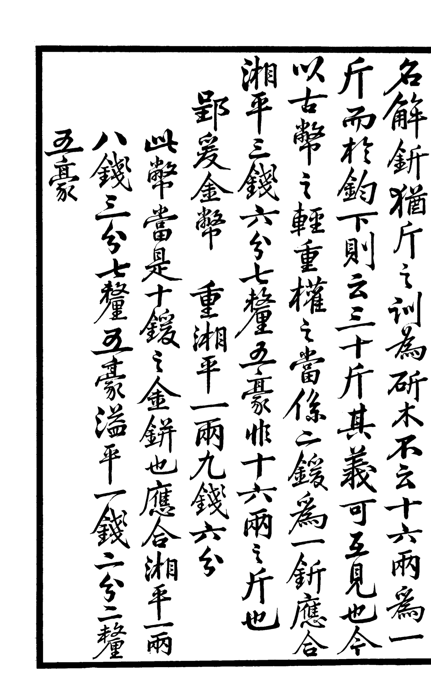
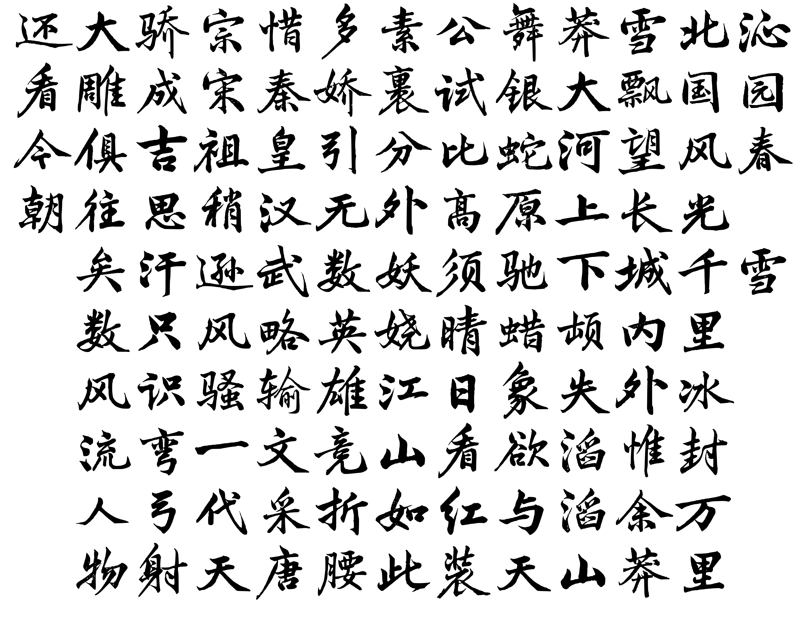
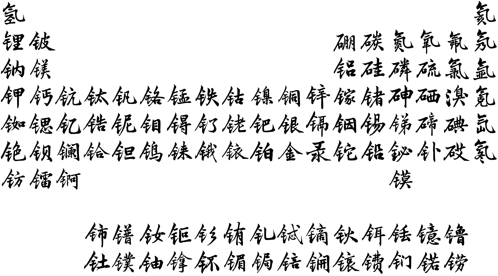
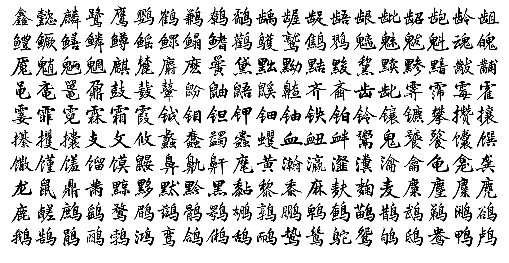

# 权衡度量体 (QuanHengDuLiang-Jian)

A Chinese calligraphy font based on handwritten characters from the Qing Dynasty text 《权衡度量实验考》. The font was created by extracting 338 characters from the original book and using zi2zi-JiT to generate the full GB2312 character set (6763 characters).

Below is a sample page from the original 《权衡度量实验考》:

  

## Production

All characters are generated in 256x256 resolution, traced with Potrace then compiled with FontForge. The entire production took approximately 10 days, including model training time.

## Samples

### 沁园春·雪 (Qin Yuan Chun Xue)

### Chinese Periodic Table

### Rare Characters

## Font Files

Font files are located in the `data/` directory:

- `QuanHengDuLiang-v0.1.ttf` - TrueType format
- `QuanHengDuLiang-v0.1.otf` - OpenType format

## Character Sources

The `source/` directory contains 338 individual character images extracted from the original text, each named after its corresponding Chinese character.

## Installation

Download the TTF or OTF file from the `data/` directory and double-click to install.

## Thanks

The original book 《权衡度量实验考》 can be viewed at [shuge.org](https://new.shuge.org/view/quan_heng_du_liang_shi_yan_kao/).

## License

MIT License - See [LICENSE](LICENSE) for details.
